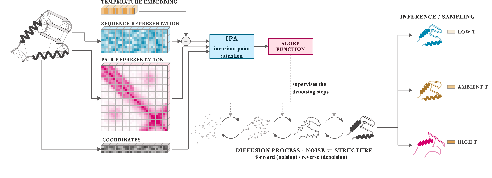

# Tempformer

**A temperature-conditioned diffusion model for generating protein conformational ensembles.**

Tempformer generates structural ensembles of a protein at a user-specified temperature by combining evolutionary-conditioning embeddings (AlphaFold / DCA / ESM-2) with an explicit temperature embedding, inside an SE(3) diffusion model built from Evoformer-style pair/single processing and Invariant Point Attention (IPA). Trained jointly across five temperatures (320–450 K) on the [mdCATH](https://github.com/compsciencelab/mdCATH) dataset, the model is constrained by a score–force correspondence to approximate a single, temperature-dependent energy landscape rather than five unrelated distributions per temperature.

<p align="center">
  
</p>

## Key results

- **Fluctuation amplitudes (RMSF)** across 258 mdCATH test proteins recover experimental/MD-consistent trends at every temperature, with an AlphaFold > DCA > ESM-2 conditioning hierarchy.
- **Secondary structure** decays non-uniformly along the sequence with temperature, tracking coevolutionary contact stability rather than a single global "disorder" parameter.
- **TICA / folding-funnel projections** for twelve fast-folding proteins, evaluated at their correct MD simulation temperature, show generated ensembles redistributing into MD-supported high-free-energy basins at high temperature.
- **Relative thermostability rankings** (Q = 0.4 native-contact threshold, 51-protein benchmark) correlate with experimental melting temperatures (r = 0.52) and correctly order mesophile/hyperthermophile and point-mutant pairs, despite a systematic high bias from finite-simulation training data.
- **Enzyme I (EI) allostery** is reported as a boundary result: Tempformer captures static multidomain flexibility but not the domain-selective, interdomain coupling that drives genuine allosteric switching — a gap attributed to training on predominantly short, single-domain trajectories.

## Repository structure

```
Tempformer/
├── protein/
│   ├── model/             # Architecture
│   │   ├── main_model.py          # MainModel: diffusion loop, temperature embedding, loss
│   │   ├── structure_module.py    # IPA-based structure module
│   │   ├── attention.py
│   │   ├── pair_encoder.py
│   │   ├── positional_encoding.py # Relative position bias
│   │   ├── so3.py                 # SO(3) noise/score utilities (adapted from DiffDock)
│   │   ├── geometry.py
│   │   └── base_model.py
│   ├── data_provider/
│   │   ├── dataset.py              # LMDB / NPY dataset wrappers, batching & padding
│   │   ├── train_loader.py
│   │   └── util.py
│   └── common/
│       ├── config.py                # Training config / job paths
│       ├── structure_analysis.py    # RMSF, Q(T), α-helix frequency, RMSD, SASA helpers
│       ├── calc_sasa.py
│       ├── fixer.py                 # PDBFixer-based structure repair
│       ├── minimize.py              # OpenMM minimization
│       ├── aa_vocab.py
│       ├── logger.py
│       ├── task_lock.py
│       └── util.py
├── run/
│   ├── train.py                    # Train on AlphaFold single/pair embeddings
│   ├── train_dca_embeddings.py     # Train on DCA (Potts model) embeddings
│   ├── train_esm_embeddings.py     # Train on ESM-2 embeddings
│   ├── inference.py / run_inference.py   # Reverse-diffusion sampling, PDB writing
│   └── utils.py                    # Shared preprocessing (frames, distances, collation)
├── analysis_scripts/
│   ├── Tm.py                           # Native-contact based Tm estimator
│   ├── compute_Tm_from_native_contacts.py  # Q(T) → Tm pipeline (Q = 0.4 threshold)
│   ├── tica_fast_folding.py            # TICA fit on MD, projection of generated ensembles
│   ├── js_divergence_fast_folding.py   # JSD (18×18) & precision (50×50) metrics on TICA landscapes
│   └── enm_rmsf_correlation.py         # Elastic-network-model RMSF baseline
├── data/
│   ├── AF_alpha_helix_errors.csv / dca_.../ esm_...      # Per-domain, per-temperature α-helix MAE/RMSE/Pearson/Spearman
│   ├── AF_alpha_helix_profiles.h5 / dca_.../ esm_...     # Per-residue helix profiles
│   └── spectral_correlations.csv                          # Per-domain RMSF correlation, by conditioning variant
└── assets/
    └── pipeline_figure.svg
```

## Installation

Requires Python ≥3.9 and a CUDA-enabled GPU for training (CPU works for inference/analysis on small proteins, but slowly).

```bash
git clone https://github.com/Divyanshu2132/Tempformer.git
cd Tempformer
pip install torch numpy pandas scipy scikit-learn matplotlib tqdm pyyaml h5py \
            biopython MDAnalysis mdtraj lmdb joblib openmm pdbfixer prody
```

`openmm`, `pdbfixer`, `prody`, and `mdtraj` are only needed for the structure-preparation utilities in `protein/common/` (`fixer.py`, `minimize.py`, `calc_sasa.py`) — training and inference alone need `torch`, `numpy`, `h5py`, `biopython`, and `MDAnalysis`.

> **Note:** several files (`protein/common/fixer.py`, `minimize.py`, `calc_sasa.py`, `structure_analysis.py`, and the `analysis_scripts/*.py` case-study defaults) contain absolute paths to the original HPC environment (e.g. `/lustre/hdd/LAS/potoyan-lab/...`). Update the `ROOT` / `DATA_DIR` / `BASE` / `GEN_DIR` constants at the top of these files (or pass the equivalent CLI flag, where available) before running elsewhere.

## Usage

### Training

Each conditioning variant has its own entry point; all use the same fixed random seed (42), a 500-domain sample split 400 train / 100 validation, and batch size 6:

```bash
python run/train.py \
    --data-dir ./data/mdcath \
    --embedding-path ./embeddings/alphafold \
    --save-path ./weights/tempformer_af.pth

python run/train_dca_embeddings.py --data-dir ./data/mdcath --embedding-path ./embeddings/dca --save-path ./weights/tempformer_dca.pth
python run/train_esm_embeddings.py --data-dir ./data/mdcath --embedding-path ./embeddings/esm --save-path ./weights/tempformer_esm.pth
```

### Sampling / inference

```bash
python run/inference.py \
    --data-dir ./data/mdcath \
    --embedding-path ./embeddings/alphafold \
    --save-path ./weights/tempformer_af.pth
```

Generates a conformational ensemble via reverse diffusion (500 timesteps) and writes structures to PDB.

### Analysis

```bash
# Thermostability (Q = 0.4 native-contact threshold)
python analysis_scripts/compute_Tm_from_native_contacts.py \
    --generated-dir <path/to/generated> --mdcath-dir <path/to/mdcath> \
    --out Tm_correlation.h5 --csv-out Tm_correlation.csv

# TICA / folding-funnel projection for a fast-folding protein
python analysis_scripts/tica_fast_folding.py --protein Trp-cage --temperature 348 --stride 100 --lag 20

# JSD + precision metrics on the same TICA landscape
python analysis_scripts/js_divergence_fast_folding.py --protein Trp-cage --temperature 348 --js-bins 18 --precision-bins 50

# Elastic-network-model RMSF baseline
python analysis_scripts/enm_rmsf_correlation.py --model anm --cutoff 15.0
```

## Data

`data/` contains the per-domain, per-temperature secondary-structure error tables and RMSF correlation tables (one set per evolutionary-conditioning variant: AlphaFold, DCA, ESM-2) used to generate Figs. 2 and 3. Raw mdCATH trajectories and generated ensembles are not tracked in this repository due to size.

## Citation

If you use this code, please cite:

<!-- ```bibtex
@article{tempformer2026,
  title   = {Tempformer: a temperature-conditioned diffusion model for protein conformational ensembles},
  author  = {TODO: author list},
  journal = {TODO: journal / preprint server},
  year    = {2026},
  note    = {Manuscript in preparation}
}
``` -->